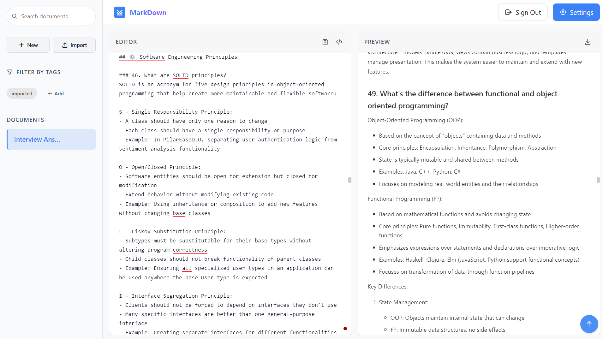

# Markdown Previewer

A powerful, feature-rich markdown editor and previewer built with React, TypeScript, and Supabase.



## Features

- **Live Markdown Preview**: See your markdown rendered in real-time as you type
- **Document Management**: Create, read, update, and delete markdown documents
- **Cloud Sync**: Syncs your documents across devices using Supabase
- **File Operations**: 
  - Upload markdown files via drag-and-drop
  - Support for .md, .txt, and text/plain files
  - Rename documents with inline editing
- **UI Customization**:
  - Toggle visibility of editor, preview pane, and sidebar
  - Dark mode support via Mantine UI
  - Responsive design for all screen sizes
- **Organization**:
  - Tag-based document organization
  - Powerful search functionality
- **Security**:
  - User authentication via Supabase
  - Enhanced error handling and debugging for auth issues
- **Modern Interface**:
  - Clean, intuitive UI powered by Mantine 8.0 components
  - Toasts for user feedback using react-toastify 11.0
  - Icon support with Tabler icons

## Tech Stack

- **Frontend**: 
  - React 19.1.0
  - TypeScript 4.9.5
  - CSS
  - Mantine UI Framework 8.0.2
- **Backend/Database**: Supabase 2.49.9
- **Markdown Parsing**: 
  - React Markdown 10.1.0
  - Remark GFM 4.0.1 (for GitHub Flavored Markdown)
  - Rehype plugins for HTML handling
- **Syntax Highlighting**: Prism.js 1.30.0
- **Notifications**: React Toastify 11.0.5
- **Analytics**: Vercel Analytics 1.5.0
- **Build Tool**: Create React App

## Getting Started

### Prerequisites

- Node.js (v18+ recommended)
- npm or yarn
- Supabase account for backend functionality

### Installation

1. Clone the repository
   ```bash
   git clone https://github.com/KCprsnlcc/markdown-previewer.git
   cd markdown-previewer
   ```

2. Install dependencies
   ```bash
   npm install
   # or
   yarn install
   ```

3. Create a `.env` file in the root directory with your Supabase credentials:
   ```
   REACT_APP_SUPABASE_URL=your_supabase_url
   REACT_APP_SUPABASE_ANON_KEY=your_supabase_anon_key
   ```

4. Start the development server
   ```bash
   npm start
   # or
   yarn start
   ```

5. Open [http://localhost:3000](http://localhost:3000) to view the app in your browser

## Available Scripts

- `npm start` - Runs the app in development mode
- `npm test` - Launches the test runner
- `npm run build` - Builds the app for production
- `npm run eject` - Ejects from Create React App configuration

## Project Structure

```
markdown-previewer/
├── public/
├── src/
│   ├── components/
│   │   ├── Auth.tsx           # Authentication component
│   │   ├── Logo.tsx           # App logo component
│   │   ├── Editor.tsx         # Markdown editing component
│   │   ├── Previewer.tsx      # Markdown rendering component
│   │   ├── SettingsPanel.tsx  # Settings management
│   │   └── Sidebar.tsx        # Document navigation
│   ├── context/
│   │   ├── AppContext.tsx     # Application state management
│   │   └── AuthContext.tsx    # Authentication state management
│   ├── utils/
│   │   └── toast.ts           # Toast notification utilities
│   ├── supabase.ts            # Supabase configuration and API
│   ├── App.css                # Main stylesheet
│   ├── App.tsx                # Main application component
│   └── index.tsx              # Entry point
└── package.json
```

## Contributing

1. Fork the repository
2. Create your feature branch (`git checkout -b feature/amazing-feature`)
3. Commit your changes (`git commit -m 'Add some amazing feature'`)
4. Push to the branch (`git push origin feature/amazing-feature`)
5. Open a Pull Request

